

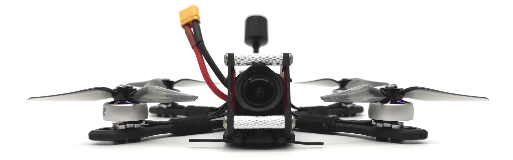

# JeNo 3" and 3.5"
***3-3.5" drone FPV frame compatible with Air Unit O3 and designed for Freestyle, Freeride and Cinematic. Many customizable options are available.***

> [!NOTE]
> Designed in France by members of the [WE are FPV](https://www.wearefpv.fr/) community, the JeNo is already flown by hundreds of pilots and is now being sold by [Drone FPV Racer](https://www.drone-fpv-racer.com/jeno-3-frame-kit-we-are-fpv-12958.html?aff=64&id_campaign=13) (affiliate link). The French version of the project is available on [Printables](https://www.printables.com/fr/model/459702-jeno-335-drone-frame). Note that a [5.1-6" version](https://github.com/WE-are-FPV/JeNo-5.1) and a [7" version](https://github.com/WE-are-FPV/JeNo-7) of the JeNo exist.

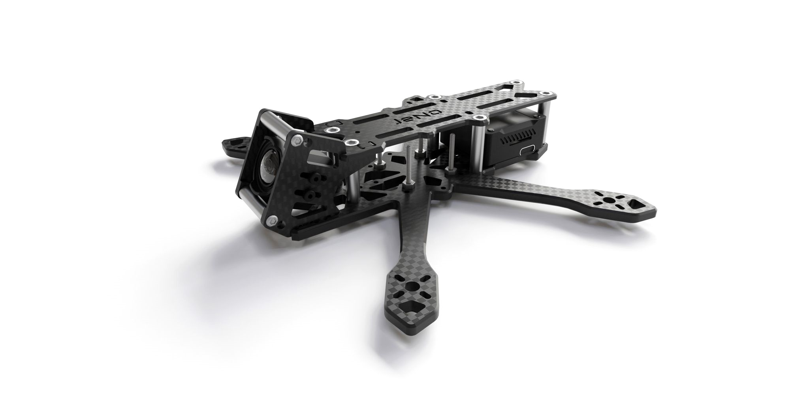

## Table of contents

* [Key features](#key-features)
* [Presentation](#presentation)
* [Detailed specifications](#detailed-specifications)
* [Customization](#customization)
* [Buy it or cut it !](#buy-it-or-cut-it-)
* [Bill of materials](#bill-of-materials)
* [Building/Assembly guide](#buildingassembly-guide)
* [Inspiration](#inspiration)
* [Tuning, Betaflight Preset ?](#tuning-betaflight-preset-)
* [Blackbox](#blackbox)
* [Videos](#videos)
* [Builds examples](#builds-examples)
* [Authors](#authors)
* [TPU](#tpu)
* [Community (remixes and TPU)](#community-remixes-and-tpu)
* [Changelog](#changelog)

## Key features
- [x] **Sturdiness** and **rigidity**
- [x] Excellent flight **performances**, easy to tune
- [x] **Wide-X** geometry
- [x] Perfect DJI **Air Unit O3** camera integration
- [x] Optional soft mounting of the camera for effective Gyroflow stabilization.
- [x] Designed for : DJI Vista/AU O3, WalkSnail, HDZero, Analogic
- [x] **Frame and standoffs NOT visible** in video feed, with any FPV camera
- [x] **Props NOT visible** in video feed !
- [x] Support 20x20 stacks as well as AiO (straight and 45° angled)
- [x] **Customizable** (weight, size, camera plates, unibody or not)

## Presentation
The success of the [JeNo 5.1"](https://github.com/WE-are-FPV/JeNo-5.1) has led us to develop a little brother, in **3 and 3.5"** form factor. This frame will therefore be just **as comfortable for Freestyle as for cinematic** shooting.

On 5" and larger builds, we might be tempted to keep an Action Cam, whereas on a **compact and light machine**, the **DJI O3 reveals its full potential**.

The design of a frame of this size turned out to be more delicate than expected :

* **Weight** is crucial
* **Strength** and **rigidity** remain major concerns
* **Electronics** are more **diversified** : 20x20 stack with separate FC and ESCs, AiO straight or angled at 45°, stack mounting with M2 or M3...
* The low inertia of this format makes the gyro of the O3 camera very sensitive; vibration tolerance is much lower than for a 5" quads
* **Clear FOV** : no spacers, frame, or visible propellers in the FPV feed

After several iterations, we have come to a first version of the JeNo that **ticks all these boxes !** This is the **3" Classic version, unibody with a 4mm bottom plate**.

We were initially not enthusiastic about the unibody design, but this approach has proven to be an **excellent compromise**. With a thickness of 4mm for the bottom plate, we get **exceptional strength** and **flight behavior** worthy of a 5". The assembly remains easy, and the absence of separate arms allows for sliding a 20x20 stack while taking advantage of the 20mm height of the body.

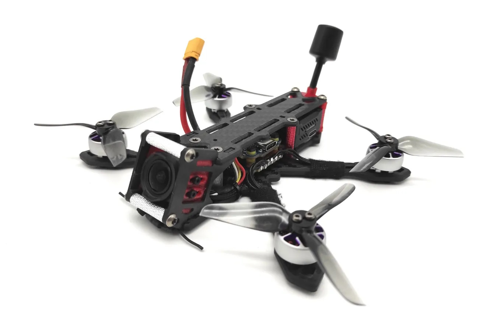

**Other versions** are available :

* 3.5" (unibody) (warning : tips of props slightly visible in the FPV feed)
* 3" (unibody) **Light**
* 3" et 3.5 " with **separate arms**
* 4": this is a variation created by Kennytak, and the necessary files are available on [his page](https://www.printables.com/fr/model/516544-jeno-4-unibody-drone-frame-for-dji03-airunit-vista). The props remain slightly visible in the FPV feed.

The **JeNo 3** follows in the footsteps of its big brother : the front cage tilted at 25° provides a **clear FOV**. Notches are provided to slide in any type of **ND filter**, and the propellers are not visible in the FPV feed or in HD recording.

Two types of camera plates are available : **full carbon** or **soft-mounted**. Note that to benefit from Gyroflow (or RockSteady) stabilization, it is **imperative to opt for the soft-mounted camera plates**.

Finally, as this frame was designed by members of the [WE are FPV](https://www.wearefpv.fr/) **community**, a **"WaF edition"** is available (the logo is engraved on the bottom plate). Join us on the WAF forum in [the official JeNo 3-3.5" thread](https://forum.wearefpv.fr/topic/20437-jeno-335-un-ch%C3%A2ssis-compact-taill%C3%A9-pour-le-dji-o3/) to discuss it further.

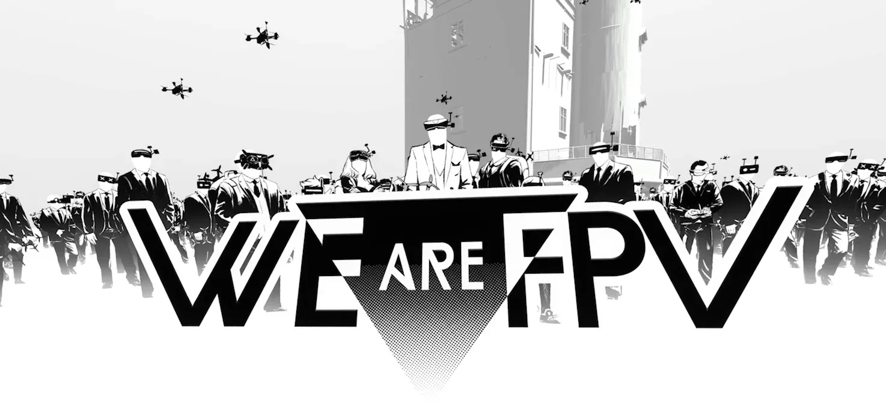

The JeNo is also available in [5.1-6" version](https://github.com/WE-are-FPV/JeNo-5.1) and [7" version](https://github.com/WE-are-FPV/JeNo-7).

## Detailed specifications

||| 
| :--- | :--- |
| **Geometry** | **Wide-X** | 
| **Props size** | 3 to 3.5" (depending on the versions) | 
| **Weight** | **40 to 55 g** depending on the versions, including screws | 
| **Arms** | **4mm** for unibody, **3mm** for separate arms | 
| **Body height** | 20 mm | 
| **Stack height** | 20 mm (unibody) | 
| **Bottom plate** | **4mm** for unibody, **2mm** for separate arms | 
| **Middle plate** | 2 mm (separate arms) | 
| **Top plate** | 2 mm | 
| **Camera plates** | 2.5 mm | 
| **Motors mounting** | 9 to 12 mm | 
| **Camera** | 20 mm (DJI), Micro, Nano. **Clear FOV**. Ajustable.
| **Main stack** | 25.5 mm x 25.5 mm (M2) AiO and 20 mm x 20 mm (M2) stack | 
| **Supported VTX** | Analogic, DJI Vista, **DJI Air Unit O3**, WalkSnail, HDZero… | 
| **Strap passage** | Yes | 

## Customization

The JeNo is customizable, offering several **options** to best adapt to different needs and individual preferences : 

* **3" Unibody 4mm Classic :** This is the first version made available. Designed for **freestyle** due to its strength, it will also be suitable for **cinematic** use with soft-mounted camera plates. 100% clear FOV. This version uses **M3** screws and standoffs.
* **3" Unibody 4mm Light :** Sacrificing some strength and rigidity for more lightweight, thus increasing autonomy, and switching to **M2** screws/spacers. A chassis more oriented towards cinematic use. Note that M2 standoffs are more difficult to source.
* **3.5" Unibody 4mm :** For those seeking a bit more **inertia and stability**, or possibly for mid-range use. _**Note: the propellers are very slightly visible in the FPV feed. With black propellers, they will be practically invisible.**_
* **Separate arms :** For those wary of unibody designs ;) a 3" version and a 3.5" version (only the length of the arms changes). _**Note: AIO strongly recommended; stacks will struggle to fit due to the low remaining height in the body = low profile !**_

Two versions of 25° **camera plates** are available: **freestyle** (full carbon) or **cinematic** (soft-mounted). 

> [!IMPORTANT]
> Please note that to benefit from Gyroflow (or RockSteady) stabilization, **soft mounting is mandatory**.

A [high tilt version](https://www.thingiverse.com/thing:6584519) (40°) is available in community remixes (by [Bard Fpv](https://www.youtube.com/@bardfpv)).

> [!IMPORTANT]
By default, we have left the stack holes at a 2mm diameter (M2). If your stack uses M3 screws, you will need to enlarge these holes. Please note, carbon dust is hazardous, to avoid inhaling it, run a trickle of water while drilling/filing.

For your information, we have tested this frame with the following setup:

* **Recommended Motors :** 1404, 4000 to 4500KV for 3"
* **Recommended Batteries :** 4S / 550mAh for Freestyle, up to 850mAh for cinematic cruising
* **Recommended Props :** T3x2.5x3 & HQ T3x3x3

Below, you will find a complete build example as well as several flight videos with this setup.

## Buy it or cut it !

It is up to you : you can get it cut or you can get a classic or cine version directly from Drone FPV Racer :

* [JeNo 3" by DFR](https://www.drone-fpv-racer.com/jeno-3-frame-kit-we-are-fpv-12958.html?aff=64&id_campaign=13) (affiliate link)

The JeNo 3" and all its variations are also available from [CNC Madness](https://cncdrones.com/WE-are-FPV_c_118.html) (Canada).

Of course, you can directly contact your favourite carbon fiber cutting service.

The ["dxf"](https://github.com/WE-are-FPV/JeNo-3-3.5/tree/main/dxf) folder contains all the files you need to get it **cut** in your favourite flavour :

* **JeNo_3inch_M3.dxf :** Classic 3" 4mm unibody frame
* **JeNo_3inch_Unibody_light_M2.dxf :** Light 3" 4mm unibody frame
* **JeNo_3.5inch_M3.dxf :** Classic 3.5" 4mm unibody frame
* **JeNo_3inch_multiplates_M3.dxf :** Separate arms 3" frame
* **JeNo_35inch_multiplates_M3.dxf :** Separate arms 3.5" frame 

> [!NOTE]
> Each file contains all parts.
> All camera plates versions are included in the files.

["extras"](https://github.com/WE-are-FPV/JeNo-3-3.5/tree/main/dxf/extras) folder will contain specific and optional parts.

## Bill of materials

In addition to the carbon fiber, you will need the following hardware to complete the assembly of the frame.

**Standoffs**

It is recommended to use 5mm diameter standoffs, especially for those that will serve as support for TPU (backpack and capacitor). Moletted standoffs can still be used, but the TPU supports will need to be modified accordingly.

> [!WARNING]
> Attention: For the Light version, you will need to provide M2 standoffs and corresponding screws (M2 instead of M3)

| Quantity | Description | Details |
| :---: | :--- | :--- |
| 6 | M3x20mm standoffs | for the body |
| 2 | M3x20mm standoffs | for the camera |

**Stack materials**

> [!WARNING]
> Attention: M2 screws are mentioned here because they are most commonly found in this format. However, some 20x20 stacks use M3 screws. In this case, you will need to enlarge the stack holes.

* If 25.5x25.5 AiO

| Quantity | Description | Details |
| :---: | :--- | :--- |
| 4 | M2x16mm | for the stack |
| 4 | M2 nuts for stack screws | |

* If 20x20 stack

| Quantity | Description | Details |
| :---: | :--- | :--- |
| 4 | M2x20mm countersunk screws | for the stack |
| 4 | M2 nuts for stack screws | |

**Frame materials**

| Quantity | Description | Details |
| :---: | :--- | :--- |
| 6 | M3x6/8mm countersunk screws | for the top plate |
| 10 | M3x8mm screws (titanium if possible) | for the bottom and camera plates |

**Additional materials**

| Quantity | Description | Details |
| :---: | :--- | :--- |
| 16 | M2x7mm screws (if using arms protections) or M2x6mm (if no TPU) | for the motors |
| 4 | M2x3mm screws if soft mounted or M2x4mm if NOT softmounted | for the camera |

**Additional materials for separate arms versions**

| Quantity | Description | Details |
| :---: | :--- | :--- |
| 5 | Pressnuts ([Flywoo](https://www.drone-fpv-racer.com/flywoo-m3-clinch-nuts-20-pcs-7965.html?aff=64&id_campaign=13#/1063-couleur-titane) or SourceOne alike) | 4 for the arms, 1 for the middle plate |
| 5 | M3x10mm screws | for the pressnuts |

**Fasten the lipos**

The JeNo allows the use of non-slip straps thanks to its strap slots. You can also use a LiPo pad if desired.

## Building/Assembly guide

Find numerous examples of builds on the _**DroneBuilds**_ page of WE are FPV.

Some **clarifications** before assembling the frame:

* If your electronics require M3 screws, you will need to slightly enlarge the holes, originally designed for M2 (taking care not to inhale carbon dust)
* You can use the front standoffs to attach a capacitor and/or an RX :

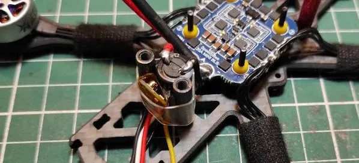

* The RX antenna can be attached to the front of the quad using zip ties (TPU front bumper also allow to fix the RX antenna)

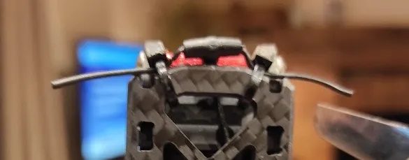

The assembly is simple (you can also find the detailed [assembly instructions in PDF format](https://github.com/WE-are-FPV/JeNo-3-3.5/blob/main/docs/Assembly_Guide_JeNo3_en.pdf) among the project files) :

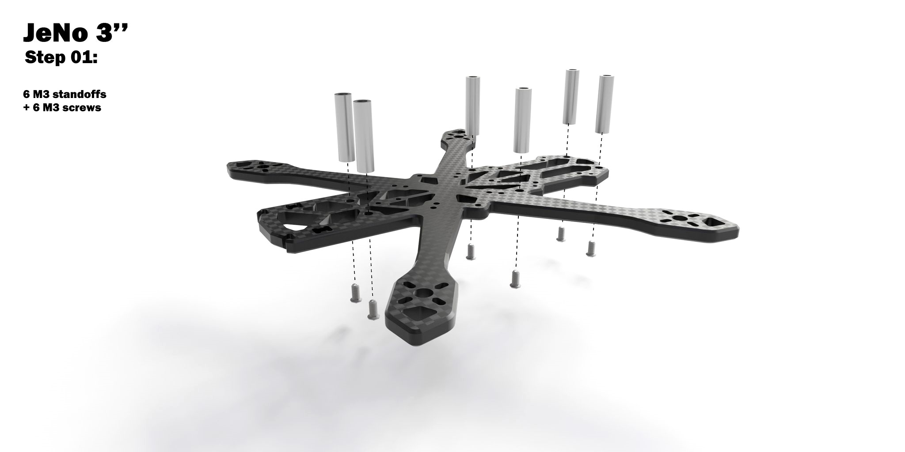

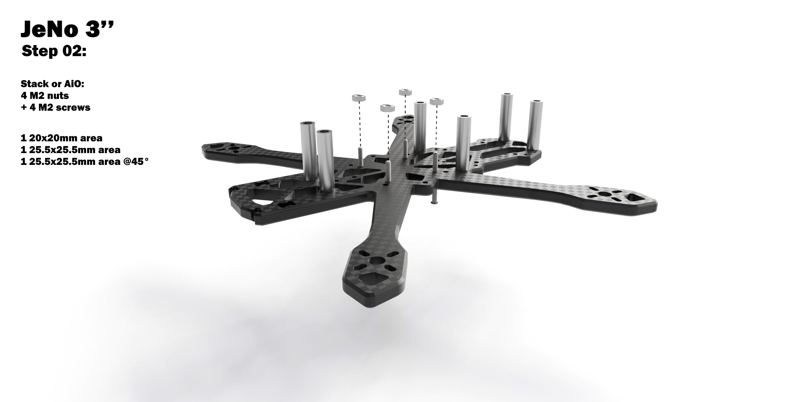

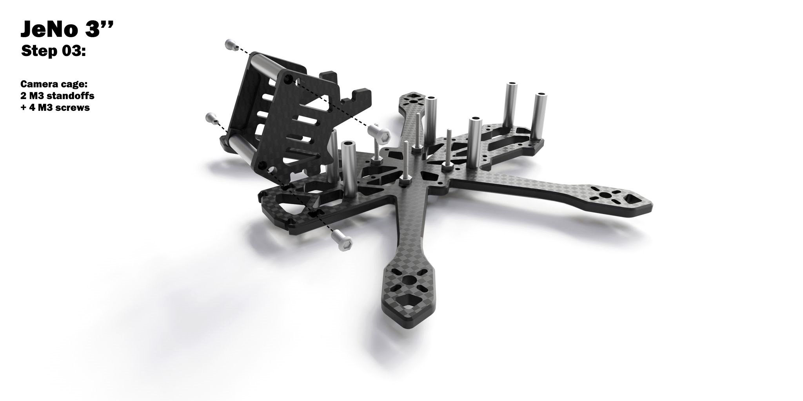

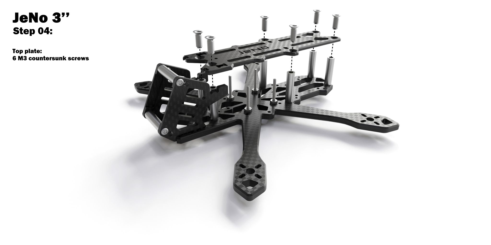

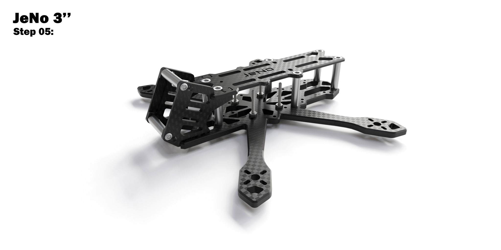

## Inspiration
It is primarily inspired by its big brother, the [JeNo 5.1"](https://github.com/WE-are-FPV/JeNo-5.1), especially for the camera plates system.

## Tuning, Betaflight Preset ?
For the JeNo 5.1", we provided a preset.

For the 3", we will not share a preset in the short term because there are **too many factors** that can alter the quad's behavior:

* Bottom plate thickness
* Stack VS AiO (the latter often being much noisier)
* M3 screws and spacers vs M2
* 3" props vs 3.5"
* Capacitor or not
* etc.

If, with a little more perspective, we see that a preset is feasible, we will share it. In the meantime, we have shared some settings that should work with most setups in [this post](https://forum.wearefpv.fr/topic/20437-jeno-335-un-ch%C3%A2ssis-compact-taill%C3%A9-pour-le-dji-o3/page/10/#comment-239643).

However, one piece of advice, if you find your quad too challenging to handle in confined spaces, do not hesitate to adjust the throttle curve by adding a bit of expo around the "hover point" :

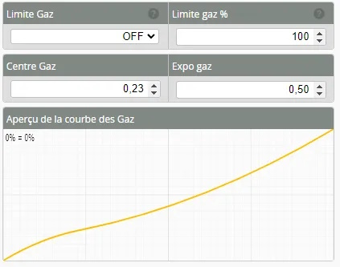

## Blackbox
Here is an overview of vibration distribution on the 3 axes for the JeNo 3" 4mm Unibody. This is indeed the **unfiltered** gyro signal freestyle flight :

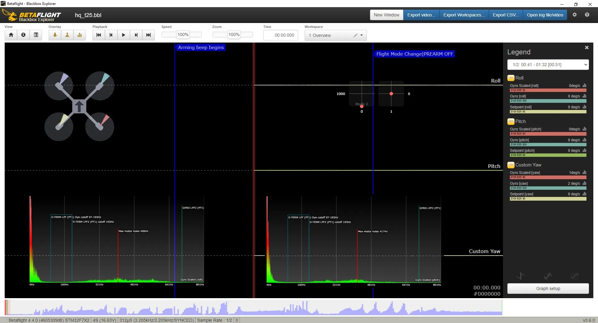

## Videos
Flight preview of the JeNo 3" Unibody Classic 4mm version (Cinematic, camera plates soft-mounted), stabilized with Gyroflow :

[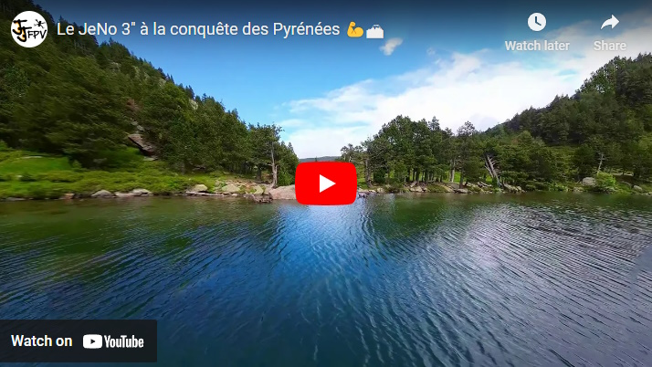](https://www.youtube.com/watch?v=Bba9C5jj3qI "JeNo 3 Cinematic - Click to Watch!")

Flight preview of the JeNo 3" Unibody Classic 4mm version (Freestyle) :

[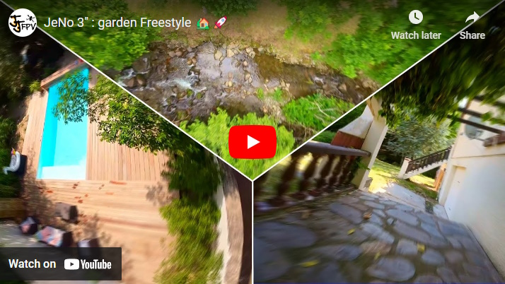](https://www.youtube.com/watch?v=a-RcqAQSSa8 "JeNo 3 Freestyle - Click to Watch!")

Flight preview of the JeNo 3" Unibody Classic 4mm version (Bando):

[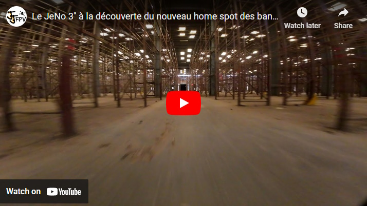](https://www.youtube.com/watch?v=Iw_Cw9_1gNU "JeNo 3 Bando - Click to Watch!")

JeNo 3" review on WE are FPV (French) :

[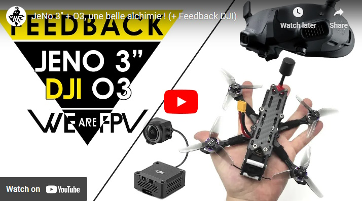](https://www.youtube.com/watch?v=-c4rGYWvYhU "JeNo 3 Review - Click to Watch!")

## Builds examples

You can find many build examples on [WE are FPV's DroneBuilds](https://forum.wearefpv.fr/71-dronebuilds/) :

* fr : [JeNo 3 Prototype](https://forum.wearefpv.fr/topic/20327-proto-jeno-3/) (this one)
* fr : [JeNo 3" AiO AT32/AM32](https://forum.wearefpv.fr/topic/21637-jeno-3-aio-at32am32/)
* fr : [JeNo 3.5" O3](https://forum.wearefpv.fr/topic/20480-jeno-35_o3/)
* fr : [JeNo 3" (6s)](https://forum.wearefpv.fr/topic/22032-jeno-3-mais-en-6s-et-sous-testost%C3%A9rone/)
* fr : [Jeno 3" (Kiss)](https://forum.wearefpv.fr/topic/21647-jeno-3-kiss/)
* fr : [jeno3 light](https://forum.wearefpv.fr/topic/22677-jeno3-light/)
* ...

## Authors

The JeNo was designed by :

* nochamo - [Youtube](https://www.youtube.com/user/nochamo)
* Jerome / Jéjé FPV - [Youtube](https://www.youtube.com/@jejefpv)

## TPU
Among the [downloadable files](https://github.com/WE-are-FPV/JeNo-3-3.5/tree/main/tpu), you will find a variety of TPU to protect your JeNo 3" :

* **VTX Antenna** mounts
* Front and back **bumpers**
* **Nano camera** adapter
* Camera **softmount**
* Several arms **protections**

## Community (remixes and TPU)

**Fork/remix**

* [JeNo 4"](https://www.printables.com/fr/model/516544-jeno-4-freestyleracing-drone-frame-for-dji03-airun) by [Kennytak](https://www.printables.com/fr/@Kennytak_77000)

**TPU**

In addition to the TPU options available on [this repo](https://github.com/WE-are-FPV/JeNo-3-3.5/tree/main/tpu), you will find here some TPU designs created by the community.

* [TPU set for JeNo 3.5"](https://www.printables.com/fr/model/533320-tpu-pour-jeno-35) by Xavier Robin
* [GPS and O3 antenna mounts](https://www.printables.com/fr/model/595138-jeno-3-antenne-option-gps-18x18x8) by Olivier
* [Shark fin to protect the lipo](https://www.thingiverse.com/thing:6416888) by vfr150878
* [Backpack O3 antenna + GPS M10 mini](https://www.printables.com/fr/model/794568-jeno-3) by [Cirbaf](https://www.printables.com/fr/@Cirbaf_1779503)
* [Arms/motors bando protections](https://www.printables.com/fr/model/649175-bando-boots-jeno-3p) by Julien
* [Runcam Thumb mount](https://www.printables.com/fr/model/647336-mount-runcam-thumb-pour-jeno3)by [Tamm'c](https://www.printables.com/fr/@TammC_1383304)
* [TPU set + 40° high tilt camera plates](https://www.thingiverse.com/thing:6584519) by [Bard Fpv](https://www.youtube.com/@bardfpv)
* [Front bumper](https://www.printables.com/fr/model/876097-bumper-jeno-3) by [Nox](https://www.printables.com/fr/@NOX_1685274)
* [M10 Mini Support, Cap, ViFly Finder, O3 Antenna](https://www.printables.com/fr/@NnJj_1076330/models) by [Nn Jj](https://www.printables.com/fr/@NnJj_1076330)
* [Full TPU set, compatible with COB LEDs](https://makerworld.com/en/models/551883) by [BinaryWhite](https://www.youtube.com/@focal3drone803)
* [Propguards to turn the JeNo 3 into a Cinewhoop](https://www.printables.com/fr/model/991129-jeno-3-cinewhoop-cage) by [Nn Jj](https://www.printables.com/fr/@NnJj_1076330)
* [TPU set](https://www.printables.com/fr/model/894556-jeno-3-tpu-pack) by [Nono31](https://www.printables.com/fr/@Nono31_454985)
* [Mount for buzzer/LED HGLRC](https://www.printables.com/fr/model/964655-jeno_3inch_antenne-hglrc-ws2812b-beeperled) by [Bruce Vanderro / Rawaï](https://www.printables.com/fr/@BruceVanderr_2315800)
* [Backpack O3 / ViFly Finder Mini](https://www.printables.com/fr/model/991436-jeno-3-support-antenne-03-buzzer-vifly-finder-mini) by [jrvaille](https://www.printables.com/fr/@jrvaille_2317118)

## Changelog

> [!TIP]
> Compatibility is consistently maintained between each version: if your frame was a v1, the parts from v1.2 will be compatible. The same applies to TPU accessories. That's why we don't keep the history of previous versions.

* **28/04/2023 :** Version 1.0